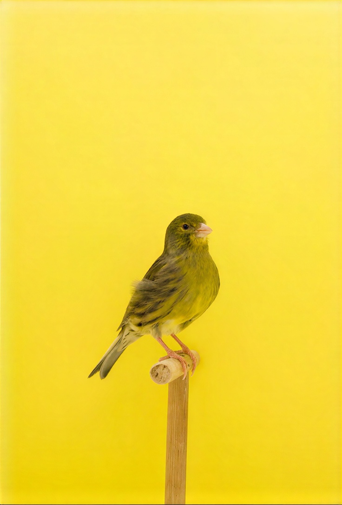
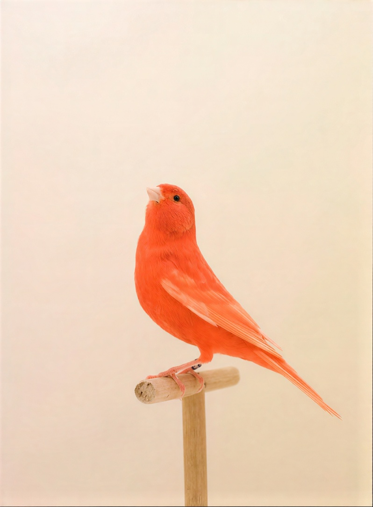
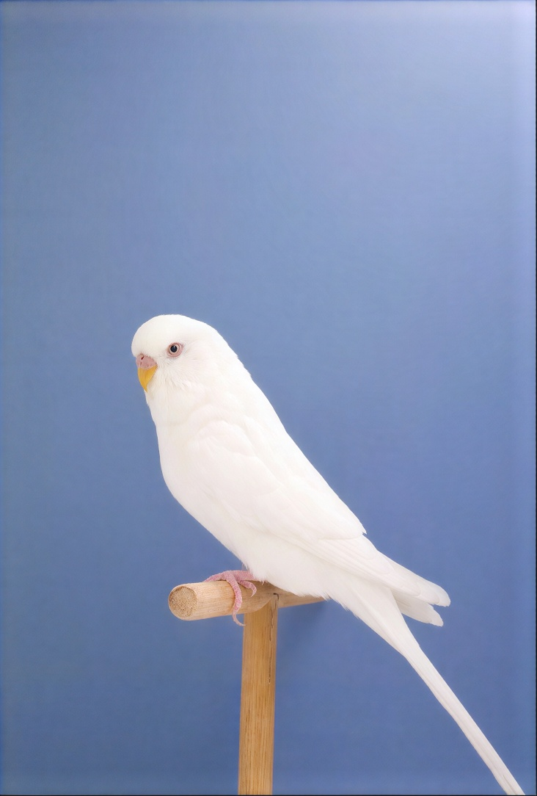
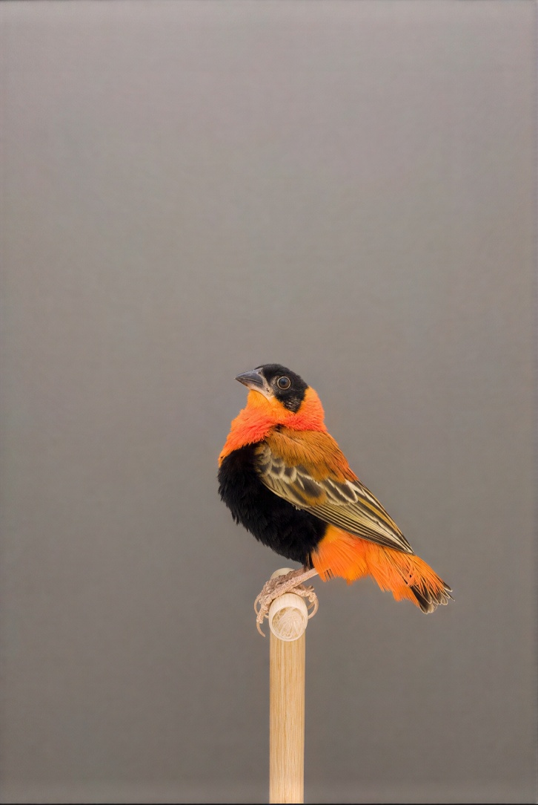
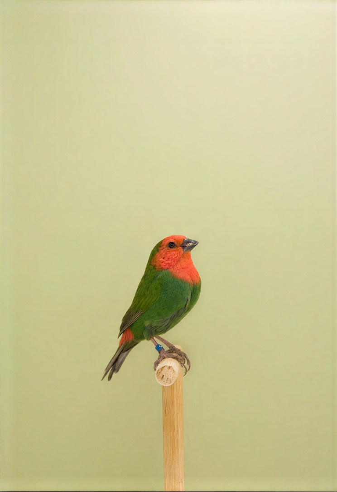
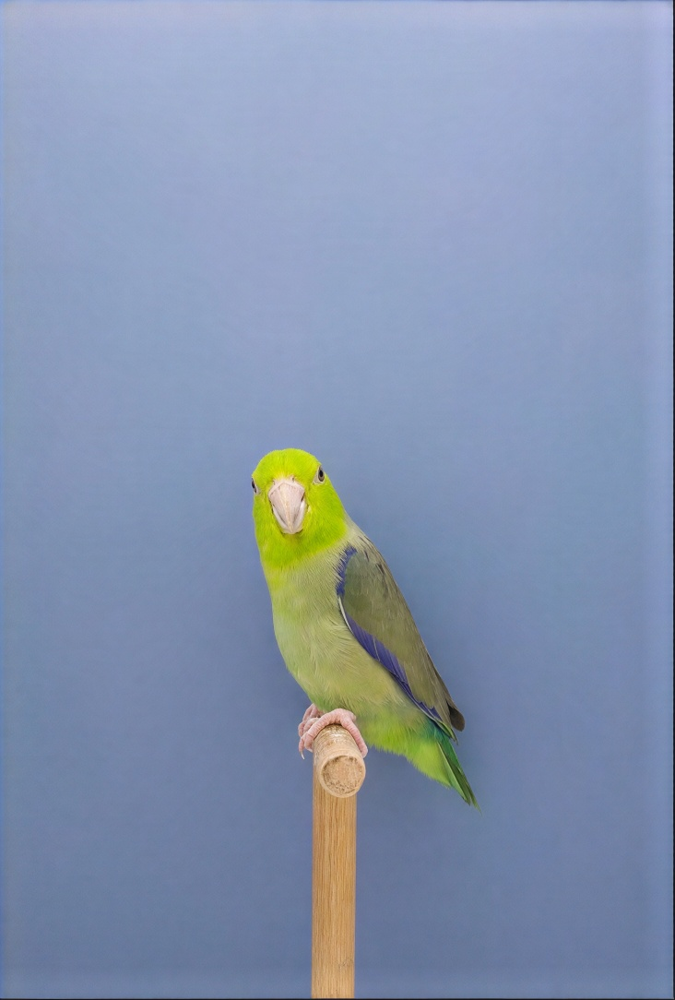
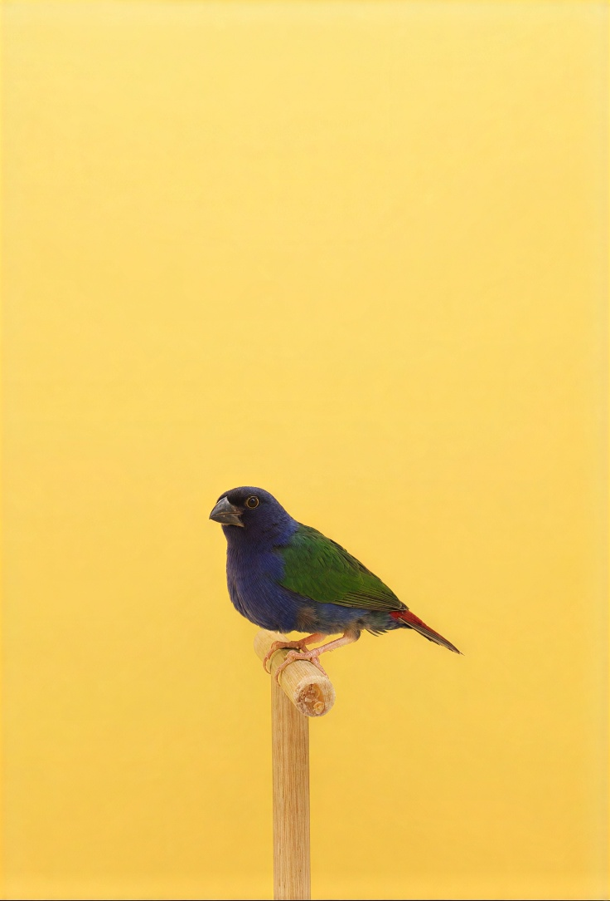

# Icon Assets

Shared visual assets for project identity, repository previews, and documentation.

These images provide a consistent visual language across projects. They may be used as project thumbnails, social previews, documentation accents, or other presentation-layer assets.

## Usage

Projects may use these assets as:

- GitHub social preview images
- LinkedIn featured project thumbnails
- GitHub Pages visual elements
- Documentation accents
- Project identity imagery

Prefer derivatives over modifying source assets.

Preserve original assets and generate project-specific variants when needed.

## Bird Visual Identity Catalog

The bird collection provides a lightweight visual vocabulary for assigning personality, tone, and recognition cues to projects.

| Asset | Name | Suggested Usage | Preview |
| --- | --- | --- | --- |
| 🟡 Yellow bird | `bird1` | Experiments, creative work, exploration |  |
| 🔴 Red bird | `bird2` | Creative projects, personal work, expressive interfaces |  |
| ⚪ White bird | `bird3` | Standards, documentation, reference material |  |
| 🟠⚫ Orange/black bird | `bird6` | Security, infrastructure, operations, systems work |  |
| 🔴🟢 Red/green bird | `bird8` | Hybrid projects, creative technology, mixed domains |  |
| 🟢 Green/yellow bird | `bird17` | Living systems, connected devices, exploratory technology |  |
| 🔵 Blue/green bird | `bird21` | Tools, utilities, libraries, developer-focused projects |  |

## LinkedIn Featured Derivatives

The `*-linkedin-1200x627.png` files are landscape derivatives prepared for
LinkedIn Featured-link thumbnails at its 1.91:1 preview ratio. They extend the
studio backgrounds without cropping the birds.

Current Featured assignments:

| LinkedIn link | Thumbnail |
| --- | --- |
| Security Engineering Portfolio | `black-headed-lovebird-linkedin-1200x627.png` |
| Operator Pipeline | `bird21-linkedin-1200x627.png` |
| SEPftSETA | `bird6-linkedin-1200x627.png` |
| Standards | `bird3-linkedin-1200x627.png` |

The remaining bird derivatives are available for future projects.

## Design Philosophy

Visual assets should support recognition and consistency without overwhelming the content.

Repository identity should communicate:

- what kind of project this is
- the character of the work
- the relationship between projects within the larger portfolio

The goal is not decoration, but creating a cohesive visual language across technical artifacts.
