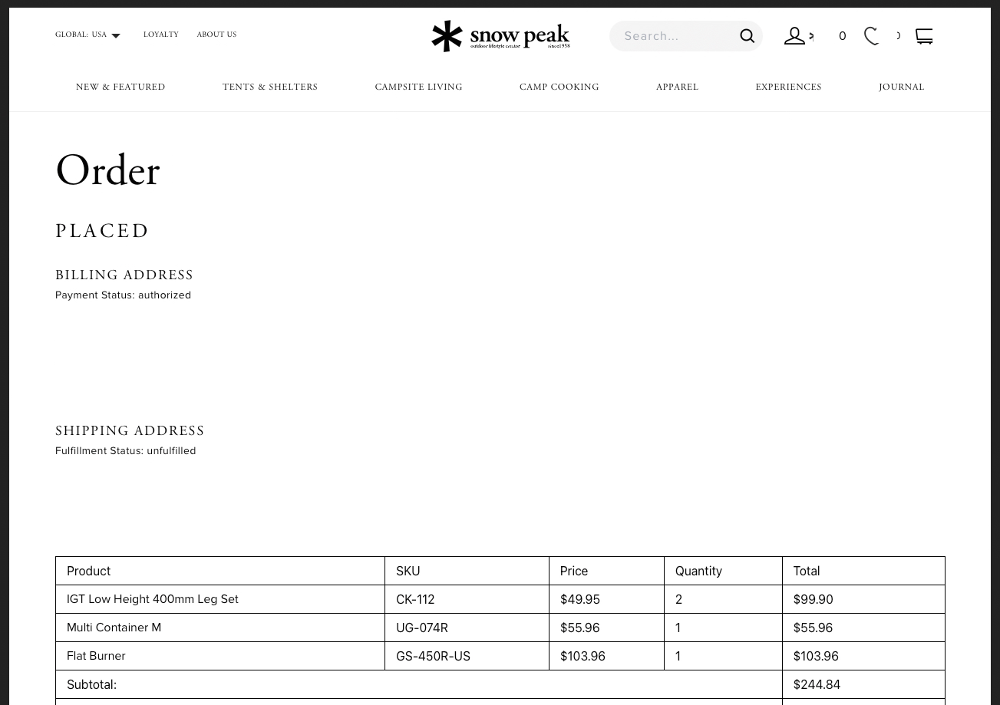

# Typefaces

This document defines the working typeface system for visual identity, documentation, spreadsheets, field manuals, and standards artifacts.

## Purpose

Typography should support the work instead of decorating it.

The system should feel:

- restrained
- operator-focused
- warm but precise
- editorial without becoming precious
- useful in documents, tables, spreadsheets, and field-manual-style artifacts

## Typeface reference set

| Typeface | Role | Character |
| --- | --- | --- |
| `Tiempos Text` | Core serif | Editorial, literary, serious, warm |
| `Söhne` | Core sans-serif | Modern, precise, operator-focused, quietly technical |
| `AGaramondPro-Regular` | Snow Peak reference serif | Heritage, elegant, catalog/lifestyle |
| `Proxima` | Snow Peak reference sans-serif | Warm, clean, commercial, useful for product tables and gear ledgers |

## Core pairings

| Pairing | Use | Personality |
| --- | --- | --- |
| `Tiempos Text` + `Söhne` | Core identity system | Modern, editorial, precise, operator-oriented |
| `AGaramondPro-Regular` + `Proxima` | Snow Peak reference system | Heritage outdoor lifestyle, warm catalog/order-table feel |
| `Tiempos Text` + `Proxima` | Gear notes, inventory ledgers, field-manual artifacts | Serious but warm |
| `Tiempos Text` + `Söhne` + `Proxima` | Tiered system | Tiempos for editorial identity, Söhne for core UI/operator work, Proxima for gear-ledger or Snow Peak-inspired artifacts |

## Snow Peak reference

Snow Peak's order page provides a useful reference for refined outdoor/lifestyle typography.

Observed display serif:

| Property | Value |
| --- | --- |
| `font-family` | `AGaramondPro-Regular` with site fallback declared as `sans-serif` |
| `font-size` | `58px` |
| `font-weight` | `400` |
| `line-height` | `62px` |
| `letter-spacing` | `normal` |
| `text-transform` | `none` |

Observed table/body sans-serif:

| Property | Value |
| --- | --- |
| `font-family` | `Proxima, sans-serif` |
| `font-size` | `16px` |
| `font-weight` | `400` |
| `line-height` | `24px` |
| `color` | `rgb(32, 32, 32)` |

## Spreadsheet and inventory use

For Snow Peak-inspired inventory or gear-ledger spreadsheets, `Proxima` is an approved reference typeface.

The Snow Peak Inventory workbook tested this table style successfully:

| Setting | Value |
| --- | --- |
| Typeface | `Proxima` |
| Size | `12 pt` |
| Weight | regular |
| Color | black |
| Background | white |
| Borders | solid black table borders |
| Gridlines | hidden |
| Alignment | left-aligned text, vertically centered |
| Images | centered horizontally and vertically |

`Proxima` may appear as a blank font field in Google Sheets when set through automation, but the visual result can still be preferable to the native `Proxima Nova` option.

## Usage guidance

Use `Tiempos Text` when the work needs an editorial, literary, or reflective voice.

Use `Söhne` when the work needs precision, interface clarity, or operator-system restraint.

Use `Proxima` when the work needs warmth, catalog utility, gear-ledger readability, or Snow Peak-inspired outdoor product language.

Use `AGaramondPro-Regular` as a reference point for Snow Peak's display language. Do not assume it should replace `Tiempos Text` in the core system.

## Practical rule

The core system remains:

| Role | Typeface |
| --- | --- |
| Serif identity | `Tiempos Text` |
| Sans-serif identity | `Söhne` |

The Snow Peak-inspired subsystem is:

| Role | Typeface |
| --- | --- |
| Heritage display reference | `AGaramondPro-Regular` |
| Product/table utility reference | `Proxima` |

For gear, outdoor, inventory, or field-manual artifacts, `Tiempos Text + Proxima` is a strong hybrid mode.

## Asset handling

Do not commit font files.

Typography standards should document roles, usage, examples, and fallbacks, not proprietary font assets.

Private or unredacted screenshots belong under ignored private source-sample directories.

Only redacted, public-safe reference images should be committed under `assets/`.
